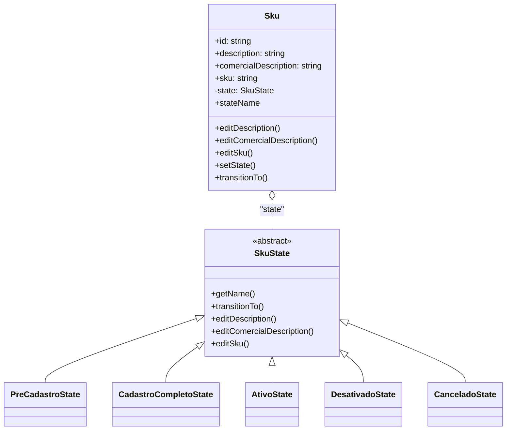

# Sistema de Gerenciamento de SKUs

Este repositório implementa um sistema completo para o gerenciamento de SKUs (Stock Keeping Units), utilizando uma arquitetura moderna baseada em Node.js, TypeScript e React. O backend adota conceitos de DDD (Domain-Driven Design) e aplica o padrão State para controlar o ciclo de vida dos SKUs e suas transições de estados.

## Visão Geral

O sistema permite criar, consultar, atualizar e alterar o estado de SKUs, garantindo que cada SKU siga um fluxo de estados bem definido, como: Pré-Cadastro, Cadastro Completo, Ativo, Desativado e Cancelado. O frontend, baseado em React, serve como interface para interação com a API.

## Domínio: SKU e Máquina de Estados

No núcleo do backend está a entidade `Sku`, que representa um item identificável no estoque. Cada SKU possui um estado, e as transições entre estados são controladas por uma máquina de estados, garantindo regras de negócio claras e seguras.

### Estados possíveis de um SKU

- **PRE-CADASTRO**: SKU recém-criado, ainda não finalizado.
- **CADASTRO-COMPLETO**: Cadastro do SKU foi finalizado.
- **ATIVO**: SKU disponível para uso/venda.
- **DESATIVADO**: SKU temporariamente indisponível.
- **CANCELADO**: SKU removido/cancelado do sistema.

Cada estado é representado por uma classe específica, herdando de uma classe abstrata `SkuState`, que define as operações permitidas e as transições válidas.

## Diagrama de Classes

Abaixo, um diagrama simplificado das principais classes do domínio:



## Estrutura de Pastas

```
gb_test/
├── backend/
│   ├── src/
│   │   ├── domain/         # Entidades, estados e enums do domínio
│   │   ├── application/    # Serviços de aplicação e erros
│   │   ├── infra/          # Infraestrutura: banco, rotas, repositórios
│   │   └── server.ts       # Inicialização do servidor
│   └── ...                 # Configurações, Dockerfile, etc.
├── frontend/               # Aplicação React (Vite)
├── GB_TEST/                # Coleção de testes (Bruno)
└── docker-compose.yaml     # Orquestração de containers
```

## API - Endpoints

Abaixo estão os principais endpoints da API de SKUs, com exemplos de uso:

| Método | Endpoint                | Descrição                        |
|--------|-------------------------|----------------------------------|
| GET    | `/skus`                 | Lista todos os SKUs              |
| GET    | `/skus/:id`             | Detalha um SKU específico        |
| POST   | `/skus`                 | Cria um novo SKU                 |
| PATCH  | `/skus/:id`             | Atualiza campos de um SKU        |
| POST   | `/skus/:id/state`       | Altera o estado de um SKU        |

### Exemplos de Uso

#### Listar todos os SKUs

```sh
curl -X GET http://localhost:3000/skus
```

**Resposta:**
```json
{
  "hasMore": false,
  "totalPages": 1,
  "data": [
    {
      "id": "uuid",
      "description": "Produto X",
      "comercialDescription": "Produto X - Versão Comercial",
      "sku": "SKU123",
      "state": "PRE-CADASTRO"
    }
  ]
}
```

#### Obter detalhes de um SKU

```sh
curl -X GET http://localhost:3000/skus/<id>
```

**Resposta:**
```json
{
  "id": "uuid",
  "description": "Produto X",
  "comercialDescription": "Produto X - Versão Comercial",
  "sku": "SKU123",
  "state": "PRE-CADASTRO"
}
```

#### Criar um novo SKU

```sh
curl -X POST http://localhost:3000/skus \
  -H "Content-Type: application/json" \
  -d '{
    "description": "Produto Y",
    "comercialDescription": "Produto Y - Comercial",
    "sku": "SKU456"
  }'
```

**Resposta:**
HTTP 204 No Content

#### Atualizar campos de um SKU

```sh
curl -X PATCH http://localhost:3000/skus/<id> \
  -H "Content-Type: application/json" \
  -d '{
    "description": "Novo nome do produto"
  }'
```

**Resposta:**
```json
{
  "id": "uuid",
  "description": "Novo nome do produto",
  "comercialDescription": "Produto Y - Comercial",
  "sku": "SKU456",
  "state": "PRE-CADASTRO"
}
```

#### Alterar o estado de um SKU

```sh
curl -X POST http://localhost:3000/skus/<id>/state \
  -H "Content-Type: application/json" \
  -d '{
    "state": "CADASTRO-COMPLETO"
  }'
```

**Resposta:**
HTTP 200 OK

> **Observação:** Os valores possíveis para o campo `state` são: `PRE-CADASTRO`, `CADASTRO-COMPLETO`, `ATIVO`, `DESATIVADO`, `CANCELADO`.

---

## Como Executar o Projeto

1. **Pré-requisitos**: Docker e Docker Compose instalados.
2. **Suba os containers**:
   ```sh
   docker-compose up --build ou docker compose up --build
   ```
3. **Acesse o frontend**: Normalmente disponível em `http://localhost:5173`
4. **API Backend**: Disponível em `http://localhost:3000`

## API Platforms

A pasta `GB_TEST` contém coleções de requisições para a API, que podem ser executadas com a ferramenta [Bruno](https://www.usebruno.com/).
